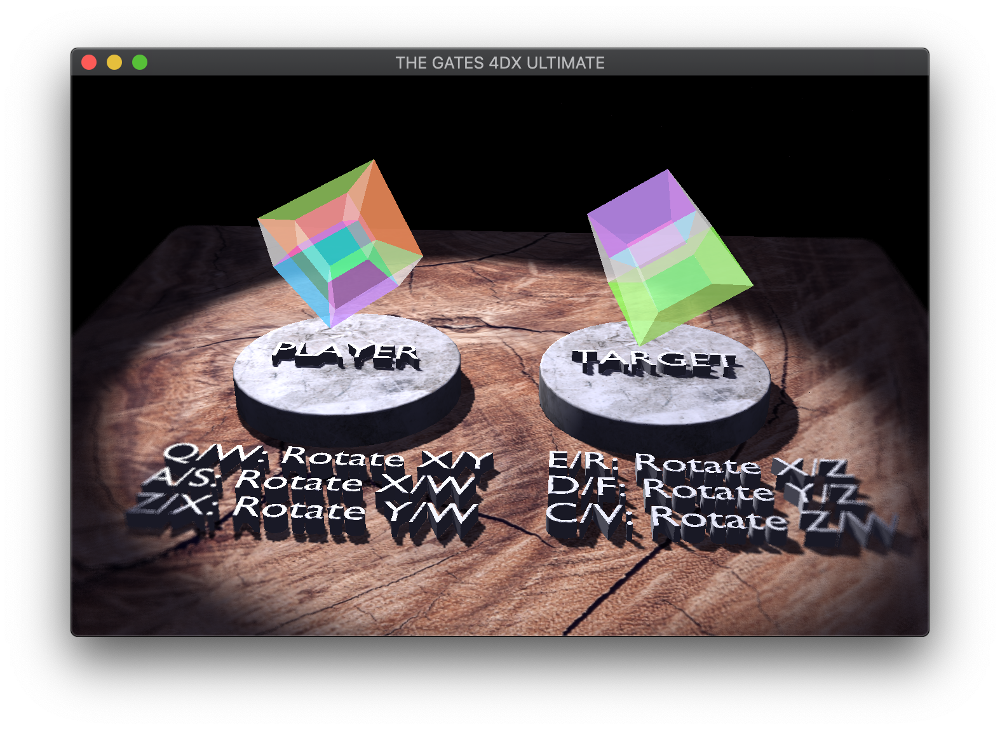

# The Gates 4DX Ultimate

Title: The Gates 4DX Ultimate (with Knuckles!)

Author: Adrian Biagioli

Design Document: [The Gates](http://graphics.cs.cmu.edu/courses/15-466-f18/game3-designs/default/)

Screen Shot:



How To Play:

Can you think in 4 dimensions?  This puzzle game has you
manipulate the 4D hypercube on the left with the goal of 
arriving at the target hypercube on the right.  Rotations
that are possible in 3D (i.e., around the X/Y/Z axes 
irrespective of W) will be synced between the two halves so that
you only need to think about the extra dimension.

Click and drag with the mouse to orbit around the scene.  You
can use the keyboard buttons shown on screen to manipulate your
hypercube.  As mentioned, transformations about the XY, YZ, or
XZ planes are synchronized between the two hypercubes.  If you
get stuck (or find yourself in gimbal lock), you can press
Backspace to reset the game.

When you think you have the answer, press Space to check!  If
you are right, the game will present you with a new challenge.

The first puzzle you are given is easy -- the first challenge
given can be solved in a single rotation.  After that, you will
need at least 2 rotations to solve each challenge.

Changes From The Design Document:

The default design had the player try and fit a 3D shape into
a 2D hole.  I thought that was boring, so I had the player 
manipulate a 4D hypercube instead!  The basic mechanics of the
game are the same, but this time around we are measuring the
orientation of a 4D object (with an orientation in R4).

Good / Bad / Ugly Code:

The most interesting part of the code in this project relates
to 4-dimensional mesh representations.  The code for this can
be found in `mesh4d.cpp` / `mesh4d.hpp`.  I also had to 
work out the geometry of a hypercube (not so easy -- there are
*24* faces to render!).  You can find the hypercube geometry
specification at the top of `GameMode.cpp`.  Although I only
use hypercubes in this game, the foundational 4D rendering code
can extend to arbitrary 4D meshes.

I chose not to use the GPU or vertex shaders to render the
hypercubes because a hypercube is simple enough that there
would be no significant performance impact of running on the 
CPU.  If I wanted to continue this project, I would likely port 
the vertex manipulation code to GLSL so that the game would run
faster.

A bit on the math used: I chose to project the 4D hypercube
using a perspective projection on the W axis.  The camera
is located at a fixed position of +3, "looking" down the -W
axis.  My renderer is capable of changing its position in
4-space, but for the purposes of this game I thought it would
be too confusing.  You can notice the default orientation looks
like two cubes inside of each other; indeed, the smaller cube
is further away from the camera in 4-space, which yields a
smaller projected volume.

An interesting challenge with this game was figuring out how
to make the orientation of the hypercube clear.  The hypercube
couldn't be opaque, because faces often intersect with each
other.  The colors also need to be distinguishable from each
other so that players can easily compare with the reference.
In the end, I chose to use semitransparent complimentary colors 
on opposite sides of the hypercube.  This way, the colors
combined in an aesthetically pleasing way but were still
easily distinguishable.  This strategy is inspired by the
character Dot (a living hypercube) from the game FEZ.

# Attribution

Much of the math behind 4D object rendering and 4D rotations 
was informed by the following Unity Answers post:

https://answers.unity.com/questions/438251/creating-a-tesseract-a-4d-cube.html

... and the code sample that was posted there by user WillNode:

http://tomkail.com/tesseract/Tesseract.cs

This Math Stackexchange post was also very helpful at defining 4D rotation:

https://math.stackexchange.com/questions/1402362/rotation-in-4d

# Changes In This Base Code

I've changed the main executable name back to 'main' and disabled building the server. However, ```Connection.*pp``` is still around if you decide to do some networking.

I've added a new shader (which you are likely to be modifying) in ```texture_program.*pp```; it supports a shadow-map-based spotlight as well as the existing point and hemisphere lights, and gets its surface color from a texture modulated by a vertex color. This means you can use it with textured objects (with all-white vertex color) and vertex colored objects (with all-white texture).
Scene objects support multiple shader program slots now. This means they can have different uniforms, programs (even geometry) in different rendering passes. The code uses this when rendering the shadow map.

This shader, along with the code in GameMode::draw() which sets it up, is going to be very useful to dig into. Particular shadow map things that were a bit tricky:

 - I'm rendering only the back-facing polygons into the shadow framebuffer; this means there is less Z-fighting on the front faces but can causes a light leak at the back of the pillar which is why there is still a little bit of bias added in the projection matrix.
 - Clip space coordinates are in [-1,1]^3 while depth textures are indexed by values in [0,1]^2 and contain depths in [0,1]. So when transforming the vertex position into shadow map space the coordinates are all scaled by 0.5 and offset by 0.5.
 - The texture_shader does the depth comparison in its shadow lookup by declaring spot_depth_tex as a sampler2DShadow and by setting the TEXTURE_COMPARE_MODE and TEXTURE_COMPARE_FUNC parameters on the texture in GameMode::draw . It also sets filtering mode LINEAR on the texture so that the result in a blend of the four closest depth comparisons.
 - When used on a sampler2DShadow, the textureProj(tex, coord) returns projection and comparison on the supplied texture coordinate -- i.e., (coord.z / coord.w < tex[coord.xy / coord.w] ? 1.0 : 0.0) -- which is very convenient for writing shadow map lookups.

I also added a blur shader that renders the scene to an offscreen framebuffer and then samples and averages it to come up with a sort of lens blur effect. (See the third part of GameMode::draw .)

# Using This Base Code

Before you dive into the code, it helps to understand the overall structure of this repository.
- Files you should read and/or edit:
    - ```main.cpp``` creates the game window and contains the main loop. You should read through this file to understand what it's doing, but you shouldn't need to change things (other than window title, size, and maybe the initial Mode).
    - ```server.cpp``` creates a basic server.
    - ```GameMode.*pp``` declaration+definition for the GameMode, a basic scene-based game mode.
    - ```meshes/export-meshes.py``` exports meshes from a .blend file into a format usable by our game runtime.
    - ```meshes/export-walkmeshes.py``` exports meshes from a given layer of a .blend file into a format usable by the WalkMeshes loading code.
    - ```meshes/export-scene.py``` exports the transform hierarchy of a blender scene to a file.
	- ```Connection.*pp``` networking code.
    - ```Jamfile``` responsible for telling FTJam how to build the project. If you add any additional .cpp files or want to change the name of your runtime executable you will need to modify this.
    - ```.gitignore``` ignores the ```objs/``` directory and the generated executable file. You will need to change it if your executable name changes. (If you find yourself changing it to ignore, e.g., your editor's swap files you should probably, instead be investigating making this change in the global git configuration.)
- Files you should read the header for (and use):
	- ```Sound.*pp``` spatial sound code.
    - ```WalkMesh.*pp``` code to load and walk on walkmeshes.
    - ```MenuMode.hpp``` presents a menu with configurable choices. Can optionally display another mode in the background.
    - ```Scene.hpp``` scene graph implementation, including loading code.
    - ```Mode.hpp``` base class for modes (things that recieve events and draw).
    - ```Load.hpp``` asset loading system. Very useful for OpenGL assets.
    - ```MeshBuffer.hpp``` code to load mesh data in a variety of formats (and create vertex array objects to bind it to program attributes).
    - ```data_path.hpp``` contains a helper function that allows you to specify paths relative to the executable (instead of the current working directory). Very useful when loading assets.
    - ```draw_text.hpp``` draws text (limited to capital letters + *) to the screen.
    - ```compile_program.hpp``` compiles OpenGL shader programs.
    - ```load_save_png.hpp``` load and save PNG images.
- Files you probably don't need to read or edit:
    - ```GL.hpp``` includes OpenGL prototypes without the namespace pollution of (e.g.) SDL's OpenGL header. It makes use of ```glcorearb.h``` and ```gl_shims.*pp``` to make this happen.
    - ```make-gl-shims.py``` does what it says on the tin. Included in case you are curious. You won't need to run it.
    - ```read_chunk.hpp``` contains a function that reads a vector of structures prefixed by a magic number. It's surprising how many simple file formats you can create that only require such a function to access.

## Asset Build Instructions

The ```meshes/export-meshes.py``` script can write mesh data including a variety of attributes (e.g., *p*ositions, *n*ormals, *c*olors, *t*excoords) from a selected layer of a blend file:

```
blender --background --python meshes/export-meshes.py -- meshes/crates.blend:1 dist/crates.pnc
```

The ```meshes/export-scene.py``` script can write the transformation hierarchy of the scene from a selected layer of a blend file, and includes references to meshes (by name):

```
blender --background --python meshes/export-scene.py -- meshes/crates.blend:1 dist/crates.scene
```

The ```meshes/export-walkmeshes.py``` script can writes vertices, normals, and triangle indicies of all meshes on a selected layer of a .blend file:

```
blender --background --python meshes/export-walkmeshes.py -- meshes/crates.blend:3 dist/crates.walkmesh
```

There is a Makefile in the ```meshes``` directory with some example commands of this sort in it as well.

## Runtime Build Instructions

The runtime code has been set up to be built with [FT Jam](https://www.freetype.org/jam/).

### Getting Jam

For more information on Jam, see the [Jam Documentation](https://www.perforce.com/documentation/jam-documentation) page at Perforce, which includes both reference documentation and a getting started guide.

On unixish OSs, Jam is available from your package manager:
```
	brew install ftjam #on OSX
	apt get ftjam #on Debian-ish Linux
```

On Windows, you can get a binary [from sourceforge](https://sourceforge.net/projects/freetype/files/ftjam/2.5.2/ftjam-2.5.2-win32.zip/download),
and put it somewhere in your `%PATH%`.
(Possibly: also set the `JAM_TOOLSET` variable to `VISUALC`.)

### Libraries

This code uses the [libSDL](https://www.libsdl.org/) library to create an OpenGL context, and the [glm](https://glm.g-truc.net) library for OpenGL-friendly matrix/vector types.
On MacOS and Linux, the code should work out-of-the-box if if you have these installed through your package manager.

If you are compiling on Windows or don't want to install these libraries globally there are pre-built library packages available in the
[kit-libs-linux](https://github.com/ixchow/kit-libs-linux),
[kit-libs-osx](https://github.com/ixchow/kit-libs-osx),
and [kit-libs-win](https://github.com/ixchow/kit-libs-win) repositories.
Simply clone into a subfolder and the build should work.

### Building

Open a terminal (or ```x64 Native Tools Command Prompt for VS 2017``` on Windows), change to the directory containing this code, and type:

```
jam
```

That's it. You can use ```jam -jN``` to run ```N``` parallel jobs if you'd like; ```jam -q``` to instruct jam to quit after the first error; ```jam -dx``` to show commands being executed; or ```jam main.o``` to build a specific file (in this case, main.cpp).  ```jam -h``` will print help on additional options.
